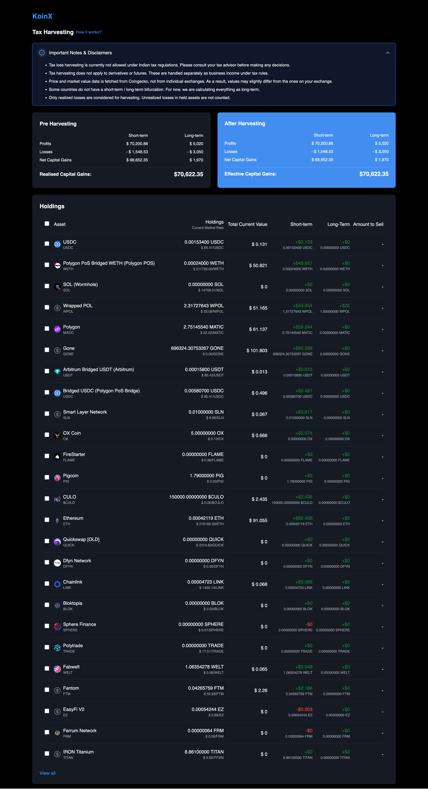
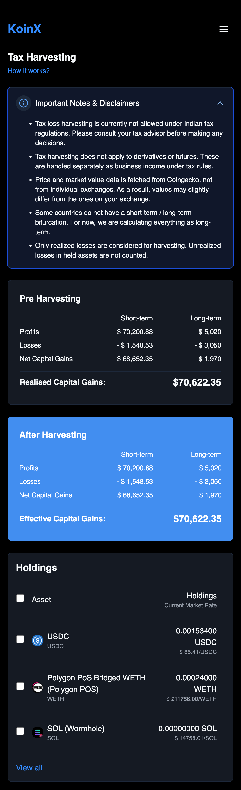

# Tax Harvesting Dashboard

A modern, responsive dashboard for cryptocurrency tax harvesting optimization. This application helps users manage their crypto portfolio and optimize their tax positions through tax-loss harvesting strategies.

## Features

- 📊 Real-time crypto portfolio tracking
- 💰 Tax-loss harvesting calculations
- 📱 Fully responsive design
- 🔄 Automatic capital gains/losses calculations
- 📈 Short-term and long-term gain separation
- ✨ Modern and intuitive UI

## Screenshots

### Desktop View


### Mobile View


## Setup Instructions

### Prerequisites

- Node.js (v14 or higher)
- npm or yarn
- Git

### Installation

1. Clone the repository:
```bash
git clone https://github.com/prabha1118/tax-optimisation.git
cd tax-optimisation
```

2. Install dependencies:
```bash
npm install
# or
yarn install
```

3. Create a `.env` file in the root directory and add your environment variables:
```env
VITE_API_URL=your_api_url_here
```

4. Start the development server:
```bash
npm run dev
# or
yarn dev
```


## Mobile Responsiveness

The application is built with a mobile-first approach and is fully responsive across all device sizes:

### Mobile Features
- Collapsible navigation menu
- Optimized tables for small screens
- Touch-friendly interface
- Responsive font sizes and spacing
- Stacked layout for better mobile viewing

### Breakpoints

The application uses the following breakpoints:

```css
- Small (sm): 640px
- Medium (md): 768px
- Large (lg): 1024px
- Extra Large (xl): 1280px
- 2xl: 1536px
```

### Mobile-Specific Components

- Sheet component for mobile navigation
- Responsive tables with horizontal scroll
- Optimized charts and data visualization
- Touch-friendly input elements

## Tech Stack

- React + TypeScript
- Vite
- Redux Toolkit
- Tailwind CSS
- Lucide Icons
- shadcn/ui Components
